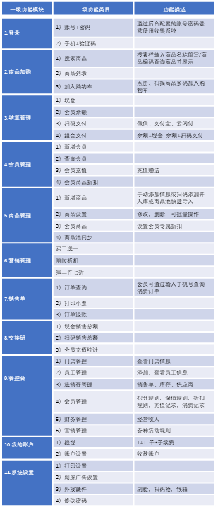

# 小象门店-智慧门店零售pos介绍

安卓原生开发的门店收银系统，支持硬件扫码枪、打印机、钱箱这些设备，实现方式都是通过AIDL进程之间通信。产品解构和定义了门店的四个元素：会员、体验、导购、运营分销。完整功能包括门店收银pos、在线商城、运营管理。其中收银系统与商米硬件对接，基于Android安卓原生开发；商城包括APP和小程序，采用uniapp开发。基于成熟的商用智慧门店产品进行门店模块开源。

#### 门店小程序

#### 收银端视频演示

 **如果对您有帮助，您可以点右上角 “Star” 收藏一下 ，获取第一时间更新，谢谢！** 

#### 需要使用请联系管理员微信： yubang1010
-  

#### 功能清单

#### 国家高新技术企业

#### 用户权益
1. 允许免费用于学习、毕设等。
2. 代码文件需保留相关license信息。
3. 禁止直接将本项目挂淘宝等商业平台出售。
4. 禁止基于本项目直接进行商业项目和获利的相关行为。
5. 非界面代码50%以上相似度的二次开源，二次开源需先联系作者。
